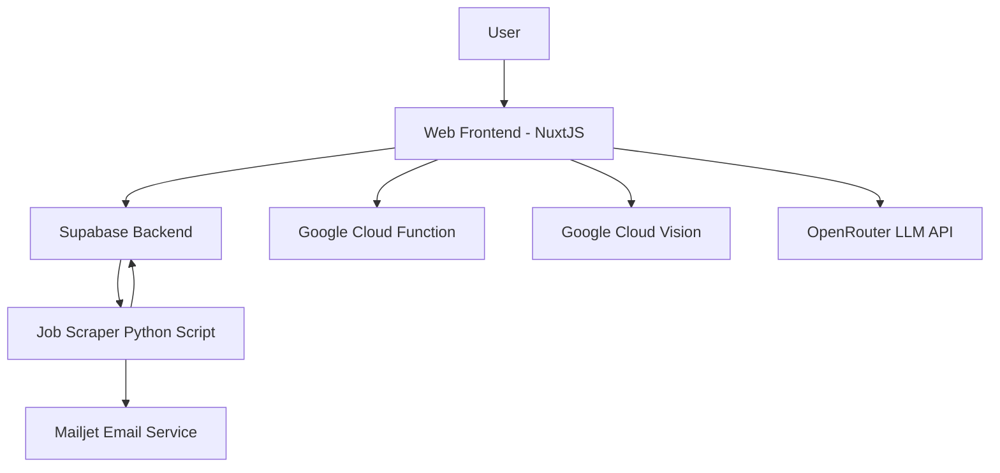

# JobScout Web Application

## Overview

This is the web frontend for the [Jobs App](https://github.com/davehague/job_scraper_py), hosted at https://jobs.timetovalue.org. The application is designed to scrape job listings and present them to users in a user-friendly interface.

*Built using NuxtJS, Vue3, and TypeScript*

## System Architecture

The Job Scraper Web Application is part of a larger ecosystem. Here's a high-level overview of the system architecture:




- **Web Frontend**: Built with NuxtJS, Vue3, and TypeScript. Handles user interactions and data presentation.
- **Supabase Backend**: Stores user data, job listings, and handles authentication.
- **Job Scraper Python Script**: Scrapes job listings from various sources and populates the database.
- **Google Cloud Function**: Provides an initial set of jobs during user onboarding.
- **Google Cloud Vision**: Processes user resumes during onboarding.
- **OpenRouter LLM API**: Handles language model interactions for advanced features.
- **Mailjet Email Service**: Manages email communications with users.

## Key Dependencies

This project relies on several key dependencies:

- **Frontend Framework**: Nuxt 3, Vue 3
- **State Management**: Pinia
- **Authentication**: Supabase, Google Sign-In
- **UI Components**: FontAwesome
- **API Integrations**: 
  - Google Cloud Storage and Vision API
  - Mailjet for email services
  - OpenRouter for LLM integration
- **Analytics**: Mixpanel, Vercel Analytics
- **Utilities**: UUID, Marked (for Markdown parsing)

For a complete list of dependencies, refer to the `package.json` file.


## Getting Started

### Prerequisites

- Node.js (v20.16.1 recommended, use [nvm](https://github.com/coreybutler/nvm-windows) for easy Node version management)
- npm (comes with Node.js)
- Git

### Installation

1. Clone the repository:
   ```bash
   git clone https://github.com/your-username/job-scraper-web-app.git
   cd job-scraper-web-app
   ```

2. Install dependencies:
   ```bash
   npm install
   ```

3. Create a `.env` file in the root directory and add the following environment variables:

   ```
   # Supabase connection
   SUPABASE_URL=https://<project_url>.supabase.co
   SUPABASE_KEY=eyJhbGci...

   # Mailjet connection
   MJ_APIKEY_PUBLIC=dd2d...
   MJ_APIKEY_PRIVATE=e3e4...

   # OpenRouter connection (LLM calls)
   OPENROUTER_API_KEY=sk-...

   # For Playwright testing
   BASE_URL=https://localhost:3000

   # To allow Google OAuth
   GOOGLE_SIGNIN_CLIENT_ID=6129...

   # For analytics
   MIXPANEL_TOKEN=6af...

   # For getting an initial set of jobs during onboarding (Google Cloud Function)
   GOOGLE_CLOUD_FUNCTION_API_KEY=AIz...

   # For processing a resume during onboarding (Google Cloud Vision)
   GOOGLE_SERVICE_KEY="ewog..."
   ```

   Replace the placeholder values with your actual API keys and credentials.

4. Start the development server:
   ```bash
   npm run dev
   ```

   The application should now be running at `http://localhost:3000`.

## Project Structure

```
job-scout-web-app/
├── assets/           # Static assets (images, fonts, etc.)
├── components/       # Reusable Vue components
├── pages/            # Vue components for each route
│   └── job/          # Job-specific pages
├── plugins/          # Vue plugins
├── public/           # Publicly accessible files
│   └── landing/      # Landing page assets
├── server/           # Server-side code
│   └── api/          # API endpoints
├── services/         # Service layer for business logic
├── stores/           # Pinia store modules
├── tests/            # Test files
├── types/            # TypeScript type definitions
├── utils/            # Utility functions
├── .env              # Environment variables
├── nitro.config.ts   # Nitro configuration
├── nuxt.config.ts    # Nuxt configuration file
├── package.json      # Project dependencies and scripts
├── playwright.config.ts # Playwright test configuration
└── tsconfig.json     # TypeScript configuration
```

## Key Features

1. **Job Listing Display**: Fetches and displays job listings from the Supabase backend.
2. **User Authentication**: Implements user sign-up, login, and Google OAuth using Supabase.
3. **Resume Processing**: Utilizes Google Cloud Vision to extract information from user-uploaded resumes.
4. **Personalized Job Recommendations**: Uses OpenRouter LLM API to provide tailored job suggestions.
5. **Email Notifications**: Sends job alerts and updates via Mailjet.
6. **Analytics**: Tracks user interactions using Mixpanel.

## Development Guidelines

## Development Tools

The project uses the following development tools:

- **TypeScript**: For static typing, see and add types under `types/interfaces.ts`
- **Playwright**: For end-to-end testing
- **ESLint** and **Prettier**: For code linting and formatting (ensure these are installed and configured in your development environment)

Refer to the `devDependencies` section in `package.json` for a complete list of development tools.

### Code Style and Formatting

- Use the official Vue formatter in VS Code.
- Follow Vue 3 Composition API best practices.
- Use TypeScript for type safety.

### State Management

- Global tate management is handled by stores provided by [Pinia](https://pinia.vuejs.org/ssr/nuxt.html)
- Keep component-specific state local using `ref` and `reactive`.

### API Integration

- Create API endpoints in `server/api` to create server side API endpoints.  Access them using `fetch` from the front-end pages.

```
  const gcpResponse = fetch('/api/onboarding', {
    method: 'POST',
    headers: {
      'Content-Type': 'application/json',
    },
    body: JSON.stringify({ user_id: uid, resume: resumePlus }),
  });
  ```

### Testing

- This project uses Playwright for end-to-end (E2E) testing

## Running Tests

- Run all tests headless: `npx playwright test`
- Run tests with UI: `npx playwright test --debug`
- Run a single test: Right-click a test in VS Code and choose "Run Test" or "Debug Test"

## Deployment

The application is currently deployed at https://jobs.timetovalue.org. For deployment updates:

1. Push changes to the main branch.
2. The CI/CD pipeline will automatically build and deploy the application.

## Recommended VS Code Extensions

- Playwright Test for VSCode
- Vue - Official

## Contributing

1. Create a new branch for your feature or bug fix.
2. Make your changes and commit them with clear, concise commit messages.
3. Push your branch and create a pull request for review.

## Resources

- [NuxtJS Documentation](https://nuxtjs.org/docs/get-started/installation)
- [Vue 3 Documentation](https://v3.vuejs.org/guide/introduction.html)
- [Supabase Documentation](https://supabase.io/docs)
- [TypeScript Documentation](https://www.typescriptlang.org/docs/)

## Support

For any questions or issues, please contact the project maintainer or create an issue in the GitHub repository.
